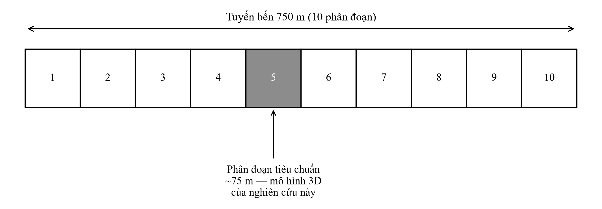
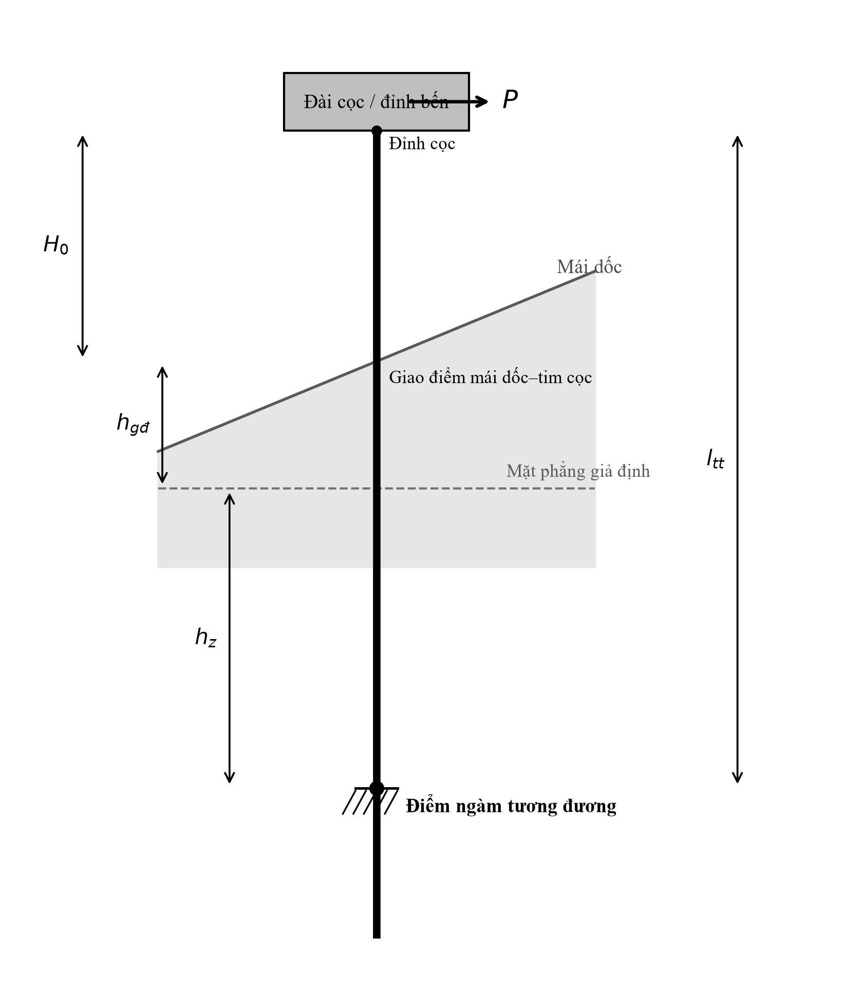
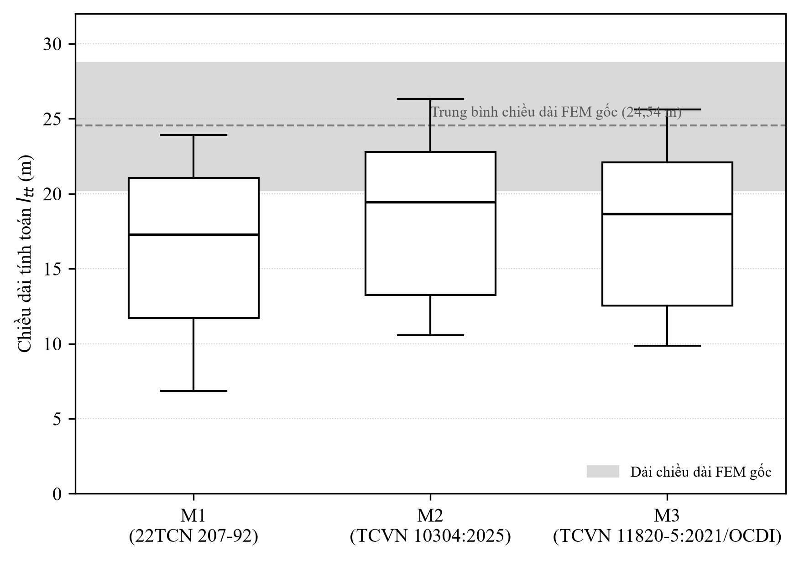
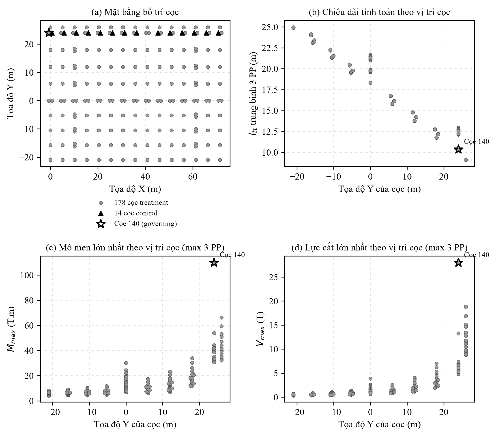

<!--
GHI CHÚ NỘI BỘ CHO NGƯỜI VIẾT — XÓA TRƯỚC KHI CHUYỂN SANG WORD/NỘP BÀI.
Trạng thái: DRAFT v11 — 12/09/2026, file "(3)". Áp dụng góp ý lần 2 (yêu cầu chỉnh sửa gửi
trực tiếp trong chat, không phải file .md riêng) lên trên nền v10 dưới đây:
(1) C3 sửa "do tái phân bố lực về cọc có độ cứng tăng vọt" → "gắn với sự thay đổi độ cứng
tương đối giữa các cọc và quá trình tái phân bố lực trong hệ" — bỏ cụm "tăng vọt" để nhất quán
với §5.3 (độ cứng riêng không được tính trực tiếp). (2) Câu cuối Tóm tắt tiếng Việt và Abstract
tiếng Anh sửa từ "cung cấp cơ sở định lượng (để) lựa chọn/for selecting giả thiết điểm ngàm"
→ "cung cấp cơ sở định lượng để đánh giá ảnh hưởng của/for assessing the influence of giả
thiết điểm ngàm" — tránh hàm ý bài đã xác định phương pháp nào đúng nhất, khớp giới hạn
validation. (3) Không đổi keywords (giữ nguyên "tương tác cọc–đất"/"pile–soil interaction" theo
đề nghị "ưu tiên giữ nguyên"). (4) Không đổi placeholder tác giả. Câu tương tự ở cuối §1
("...cung cấp cơ sở định lượng cho việc lựa chọn giả thiết điểm ngàm...") CHƯA sửa vì yêu cầu
lần 2 chỉ nêu đích danh Abstract — cân nhắc đồng bộ câu này ở vòng rà soát kế tiếp nếu muốn.
--
Trạng thái trước đó: DRAFT v10 — 12/09/2026. Áp dụng góp ý trong "09.12 gop y Paper1_JMST_Draft_v1.md":
(1) Bảng 1 sửa "Phần mềm phân tích": model gốc dựng ở SAP2000 v14.1.0 (hồ sơ thiết kế [1]),
nhưng BASE + 4 mô hình độ nhạy của NGHIÊN CỨU NÀY thực chất được chạy lại bằng SAP2000 v24.0.0
Ultimate qua OAPI — xác nhận từ log thật `scripts/connect_test.log`
("SAP2000 v24.0.0 Ultimate 64-bit, Analysis Build 9894/64"), không phải suy đoán. Đã sửa để
không còn mâu thuẫn phiên bản. (2) §2.2 bổ sung 2 câu mô tả đúng thao tác mô hình hóa thật —
di chuyển joint đáy cọc (cùng joint ID, dọc trục cọc gốc) tới vị trí $l_{tt}$ mới bằng
`PointObj.SetSelected`+`EditGeneral.Move` trong OAPI, spring U3 gốc tự động đi theo vì không
xóa/tạo lại joint — lấy đúng từ `scripts/run_sensitivity_full.py` và
`scripts/prep_new_bottom_coords.py`, không suy đoán. (3) §5.3 giảm mức khẳng định về "độ cứng
riêng cọc 140" theo đúng hướng góp ý — nhấn cơ chế là suy luận định tính, không phải đại lượng
tính trực tiếp. (4) C4 viết lại theo đề nghị góp ý (nhấn độ nhạy tập trung ở cọc biên/chi phối).
(5) Đoạn giới hạn nghiên cứu cuối §6 viết lại an toàn học thuật hơn — bỏ khẳng định "cơ chế vẫn
tuân theo quy luật đã chứng minh" khi chưa có phân tích độ nhạy địa chất. (6) Ref [7] bổ sung
năm xuất bản 2019 và sửa đúng tên NXB (Nhà xuất bản Xây dựng, không phải Hàng hải) — do tác giả
xác nhận trực tiếp (12/09/2026).
CÒN CHỜ THÔNG TIN TỪ TÁC GIẢ (chưa tự điền, theo quyết định của tác giả 12/09/2026 — giữ nguyên
placeholder, xử lý ở bước rà soát cuối trước khi nộp): họ tên/đơn vị công tác/chức danh/email
tác giả liên hệ (mục tác giả đầu bài vẫn là "NCKH*"/"abc@gmail.com").
--
Trạng thái trước đó: DRAFT v9 — 26/08/2026. Kết hợp bản rút gọn của người dùng (v8) + góp ý phản
biện trong GOP_Y_HOAN_THIEN_BAI_BAO_JMST.md.
Đã áp dụng từ v8 (người dùng tự sửa): minh bạch nguồn mô hình gốc §2.1 (liêm chính khoa
học); đánh lại đúng thứ tự trích dẫn [1]-[7] theo lần xuất hiện đầu tiên; bổ sung cơ quan
ban hành/NXB cho [5],[7]; rút gọn mạnh §2-§6 (thân bài ~6.800 → dưới 3.000 từ).
Đã bổ sung thêm từ góp ý phản biện (chưa có trong v8): (1) tiêu đề rút gọn vừa phải (bỏ
"của một phân đoạn bến điển hình", GIỮ "chiều dài tính toán" vì đây là 1 trong 2 biến phụ
thuộc chính — không cắt triệt để như đề xuất gốc vì sẽ mất từ khóa quan trọng cho RQ1);
(2) sửa thuật ngữ tiếng Anh "buckling length"→"pile length" (title+keywords) vì "buckling"
dễ gây hiểu nhầm sang ổn định Euler, trong khi bài nghiên cứu uốn ngang/nội lực, không phải
ổn định; (3) §4.1 làm rõ MASTER là mô hình tham chiếu, không phải nghiệm chuẩn; (4) §4.3
làm rõ S_R là chỉ số biến thiên tương đối quy ước, không phải hệ số nhạy vi phân; (5) §5.3
mềm hóa lập luận k∝1/l_tt³ (chỉ đúng định tính cho console lý tưởng, hệ 3D còn chịu ảnh
hưởng độ cứng dầm-bản); (6) cuối §1 thêm câu về giới hạn validation (không có số liệu quan
trắc để xác định phương pháp nào "đúng"); (7) §5.1 nêu chính xác thứ tự M3<M1<M6<M2 thay
vì chỉ nói "M1 và M3 ngắn nhất"; (8) khôi phục cờ 🔶 năm xuất bản còn thiếu ở ref [7] (bị
mất khi v8 rút gọn — chưa có thông tin thật để điền, không tự bịa năm).
ĐÃ VẼ 4 HÌNH (26/08/2026, PNG 300dpi, Times New Roman, chèn caption dưới hình theo §27):
scripts/fig1_segment.py, fig2_fixity_concept.py, fig3_boxplot_ltt.py, fig4_spatial.py ->
figures/Fig1-4_*.png. Hình 4 (quan trọng nhất) tính lại M_max/V_max per-pile (max qua 4
phương pháp) từ sap_work/results/pile_force_*.csv, xac nhan cum coc Y=24/26 (dac biet coc
140) chi phoi — khop voi lap luan da viet o §5.3.
ĐÃ CONVERT SANG .DOCX (26/08/2026): Paper1_JMST_Draft_v1.docx — dựng bằng script
scripts/build_docx.js (đọc trực tiếp file .md này, không transcribe tay), style/font/màu
tiêu đề lấy đúng từ JMST-Template Lĩnh vực 01 final-OTH.docx (style JMST_Title level 01,
JMST_Content, JMST_Table Title, JMST_Fig Title...): Times New Roman, thân bài cỡ 10, tiêu
đề mục cỡ 11 đậm màu #990033, trang A4 lề đúng mẫu (top 1701/right 1418/bottom 1418/left
1588 twips). Tóm tắt+Abstract đặt trong khung bảng viền đôi như bài mẫu đã đăng
(JMST-22091). Bảng: caption trên bảng, viền mảnh, header tô nền. Hình: caption dưới hình.
Công thức/biến số (S_R, U_X, h_z...) tự động chuyển subscript đúng qua regex tách theo "_".
Đã render thử qua Word COM (docx2pdf) và đo bằng pymupdf: **XÁC NHẬN ĐÚNG 7 TRANG** (đã sửa
lỗi bảng bị vỡ layout — thiếu columnWidths/DXA khiến 1 bảng chiếm cả trang — và rút gọn
kích thước hình/spacing qua nhiều vòng lặp để vừa khít 7 trang).
Đã bỏ 3 dòng "Ngày nhận bài/Ngày nhận bản sửa/Ngày duyệt đăng" khỏi .docx (không bỏ khỏi
.md) — theo đúng §27.3, đây là 3 dòng DO TÒA SOẠN ĐIỀN, không phải nội dung tác giả; giữ
lại sẽ tốn ~0,1 trang cho placeholder "xx/xx/20xx" vô nghĩa, đẩy bài sang 8 trang.
CÒN THIẾU (chưa xử lý, xem GOP_Y_HOAN_THIEN_BAI_BAO_JMST.md để biết chi tiết/ưu tiên):
- Tác giả/đơn vị công tác vẫn là placeholder (NCKH/abc@gmail.com) — cần sửa TRONG CẢ .md
  và chạy lại `node scripts/build_docx.js` (từ thư mục scratch_docx, cần node_modules
  `docx`+`image-size` đã cài ở đó) để tạo lại .docx.
- Ref [7] (Nguyễn Văn Ngọc) còn thiếu năm xuất bản — chưa có thông tin thật để điền.
- Chưa có header/footer/số trang trong .docx (template gốc có headerReference/
  footerReference riêng cho trang đầu — thường do tòa soạn tự thêm khi dàn trang, chưa
  làm ở bước này để ưu tiên đúng 7 trang trước).
-->

# ẢNH HƯỞNG CỦA PHƯƠNG PHÁP XÁC ĐỊNH ĐIỂM NGÀM CỌC ĐẾN CHIỀU DÀI TÍNH TOÁN VÀ ĐÁP ỨNG KẾT CẤU CẦU TÀU: NGHIÊN CỨU SỐ BẰNG MÔ HÌNH SAP2000 3D

EFFECTS OF EQUIVALENT PILE FIXITY DETERMINATION METHODS ON EFFECTIVE PILE LENGTH AND STRUCTURAL RESPONSE OF A PILED WHARF: A THREE-DIMENSIONAL SAP2000 NUMERICAL STUDY

NCKH*

*Email liên hệ: abc@gmail.com

🔶 *[Cần thay bằng chức danh/đơn vị công tác chính thức trước khi nộp bài]*

DOI: https://doi.org/10.65154/jmst.%ID *(tòa soạn cấp sau khi nộp)*

---

**Tóm tắt**

Cọc cầu tàu thường được mô hình hóa bằng một điểm ngàm tương đương thay cho tương tác đất–cọc thực tế; vị trí điểm ngàm quyết định chiều dài tính toán, ảnh hưởng độ cứng và nội lực toàn hệ, nhưng mức khác biệt giữa các phương pháp truyền vào đáp ứng kết cấu thực tế đến đâu chưa được lượng hóa. Bài báo trình bày thí nghiệm số kiểm soát trên mô hình SAP2000 3D của một phân đoạn tiêu chuẩn (~75 m) cầu tàu 100.000 DWT, Lạch Huyện, gồm 192 cọc: 178 cọc đổi điểm ngàm theo bốn phương pháp (22TCN 207-92; 20TCN21-86/TCXD 205-1998; TCVN 10304:2014; Nhật Bản), 14 cọc giữ nguyên làm nhóm kiểm soát; hình học, vật liệu, tải trọng không đổi giữa các mô hình. $l_{tt}$ trung bình theo bốn phương pháp dao động 16,0–18,6 m, thấp hơn chiều dài điểm ngàm giả thiết (~24,5 m) của mô hình gốc. Chuyển vị toàn hệ giảm 18–49% so với mô hình gốc, độ nhạy vừa phải giữa bốn phương pháp ($S_R$ = 18,5–26,5%); nội lực cực trị cọc lại rất nhạy ($S_R$ = 86,3% cho mô men, 199,4% cho lực cắt lớn nhất), tập trung tại một số cọc biên do tái phân bố lực qua dầm/bản đỉnh bến. Lực cắt cực trị cọc nhạy nhất, chuyển vị toàn hệ ít nhạy nhất — cung cấp cơ sở định lượng để đánh giá ảnh hưởng của lựa chọn giả thiết điểm ngàm khi mô hình hóa cầu tàu.

**Từ khóa**: *cầu tàu, điểm ngàm tương đương của cọc, chiều dài tính toán, tương tác cọc–đất, độ nhạy kết cấu, SAP2000, nghiên cứu số.*

**Abstract**

Piles of a piled wharf are commonly modeled with a single equivalent fixity point that replaces the actual pile–soil interaction; this point's position governs the pile's effective length and therefore the stiffness and internal forces of the whole system, but how much the difference among fixity-determination methods propagates into the response of a real three-dimensional wharf has not been clearly quantified. This paper presents a controlled numerical experiment on a 3D SAP2000 model of one standard 75-m segment of the 100,000-DWT berth at Lach Huyen Port, Hai Phong, comprising 192 piles: fixity was varied for 178 piles using four methods (22TCN 207-92; 20TCN21-86/TCXD 205-1998; TCVN 10304:2014; and the Japanese method), while 14 piles were kept fixed as a control group, with geometry, materials, and loading unchanged across models. The mean effective length $l_{tt}$ ranged from 16.0 to 18.6 m across the four methods, below the ~24.5-m fixity depth assumed in the original model. Global displacement decreased by 18-49% relative to the original model, with moderate sensitivity among methods ($S_R$ = 18.5-26.5%), whereas the extreme pile internal forces were highly sensitive ($S_R$ = 86.3% for the maximum bending moment, 199.4% for the maximum shear force), concentrated at a few edge piles through load redistribution via the deck. The extreme pile shear force is the most sensitive response and global displacement the least sensitive, providing a quantitative basis for assessing the influence of fixity assumptions in the numerical modeling of piled wharves.

**Keywords**: *piled wharf, equivalent pile fixity, effective pile length, pile–soil interaction, structural sensitivity, SAP2000, numerical analysis.*

---

## 1. Mở đầu

Cầu tàu là kết cấu phổ biến tại các cảng nước sâu, trong đó hệ dầm–bản đỉnh bến truyền tải trọng khai thác, tải trọng tàu và tải trọng môi trường xuống nền qua hệ cọc; cọc cầu tàu chịu đồng thời tải đứng, tải ngang và mô men lớn (neo tàu, va tàu, cần trục, sóng/dòng chảy/gió), nên ứng xử ngang của cọc phụ thuộc rất lớn vào điều kiện liên kết cọc–đất, đặc biệt ở vùng địa chất yếu như cửa sông, cửa biển. Mô phỏng đầy đủ tương tác đất–cọc phi tuyến (lò xo p–y phân bố) làm tăng đáng kể độ phức tạp mô hình 3D; cách tiếp cận thực dụng, phổ biến trong thiết kế là thay thế toàn bộ ảnh hưởng của nền bằng một **điểm ngàm tương đương** tại độ sâu $h_z$, qua đó xác định chiều dài tính toán $l_{tt}$ (đoạn cọc từ đỉnh đến điểm ngàm) — đại lượng quyết định độ cứng ngang, phân bố nội lực và chuyển vị của toàn hệ.

Các tiêu chuẩn/tài liệu khác nhau — 22TCN 207-92, 20TCN21-86/TCXD 205-1998, TCVN 10304:2014, và phương pháp Nhật Bản — đưa ra công thức $h_z$ khác nhau do khác cơ sở lý thuyết, dữ liệu đầu vào và phạm vi áp dụng, nên có thể cho $h_z$ (và $l_{tt}$) khác nhau cho cùng một cọc, cùng điều kiện địa chất. Tuy nhiên, mức khác biệt đó thực sự truyền vào đáp ứng kết cấu (chuyển vị, nội lực cọc) của một cầu tàu 3D thực tế đến đâu vẫn chưa được lượng hóa có kiểm soát — các nghiên cứu hiện có thường trình bày hoặc so sánh công thức một cách độc lập, không đặt trong một mô hình kết cấu thống nhất để đánh giá ảnh hưởng thực tế đến đáp ứng công trình. Đây là khoảng trống nghiên cứu mà bài báo giải quyết: **các phương pháp xác định điểm ngàm có thể cho giá trị khác nhau, nhưng cần lượng hóa có kiểm soát xem sự khác biệt đó có thực sự tạo ra sai khác đáng kể trong đáp ứng của một hệ cầu tàu 3D thực tế hay không.**

Bài báo đặt ra ba câu hỏi nghiên cứu — **RQ1**: bốn phương pháp tạo mức khác biệt như thế nào về $h_z$ và $l_{tt}$? **RQ2**: sự khác biệt đó ảnh hưởng thế nào đến chuyển vị hệ ($U_X$, $U_Y$) và nội lực cọc ($M_{max}$, $V_{max}$)? **RQ3**: đại lượng đáp ứng nào nhạy nhất với giả thiết điểm ngàm? — tương ứng hai mục tiêu: (1) định lượng khác biệt $h_z$/$l_{tt}$ giữa bốn phương pháp trên cùng nhóm cọc; (2) định lượng ảnh hưởng của khác biệt đó đến $U_X$, $U_Y$, $M_{max}$, $V_{max}$ trên một mô hình cầu tàu 3D thực tế.

Đóng góp chính của bài báo là xây dựng một thí nghiệm số có kiểm soát trên mô hình cầu tàu 3D thực tế — trong đó chỉ duy nhất giả thiết điểm ngàm thay đổi, tách riêng khỏi ảnh hưởng hình học/tải trọng thường bị trộn lẫn trong các so sánh trước đây — để so sánh thống nhất bốn phương pháp phổ biến trong cùng một mô hình và định lượng chuỗi nhân quả, cung cấp cơ sở định lượng cho việc lựa chọn giả thiết điểm ngàm khi mô hình hóa cầu tàu. Phạm vi bài báo giới hạn ở việc lượng hóa độ nhạy này; bài báo không đề xuất phương pháp xác định điểm ngàm mới, không thực hiện tối ưu hóa kết cấu, và không mở rộng sang phân tích tương tác đất–cọc phi tuyến kiểu p–y. Do không có số liệu quan trắc biến dạng/nội lực thực tế của công trình để hiệu chỉnh hoặc kiểm chứng, nghiên cứu không sử dụng kết quả của bất kỳ phương pháp nào — kể cả mô hình gốc — làm nghiệm chuẩn; mục tiêu duy nhất là lượng hóa mức độ ảnh hưởng của lựa chọn giả thiết điểm ngàm đến đáp ứng kết cấu.

---

## 2. Công trình nghiên cứu và mô hình số

### 2.1. Công trình và phạm vi mô hình

Công trình nghiên cứu là cầu tàu 100.000 DWT thuộc Dự án đầu tư xây dựng cảng cửa ngõ quốc tế Hải Phòng (Lạch Huyện), Hợp phần B, gói thầu thiết kế XL01. Cầu tàu có tổng chiều dài tuyến bến 750 m, được chia thành 10 phân đoạn thi công/tính toán, mỗi phân đoạn dài khoảng 75 m.

**Mô hình số 3D sử dụng trong nghiên cứu này đại diện cho một phân đoạn tiêu chuẩn (~75 m) trong số 10 phân đoạn nêu trên, không phải toàn bộ tuyến bến 750 m.** Lựa chọn này phù hợp vì các phân đoạn có hình học, hệ cọc và tải trọng thiết kế tương tự nhau, đây là quy mô mô hình FEM 3D chi tiết duy nhất hiện có, và độ nhạy của đáp ứng kết cấu với giả thiết điểm ngàm là hiện tượng cục bộ ở cấp độ cọc/phân đoạn, không đòi hỏi mô hình toàn tuyến. Để đảm bảo liêm chính khoa học trong việc tái sử dụng dữ liệu, mô hình gốc (hình học, mặt cắt, tải trọng) được kế thừa trực tiếp từ hồ sơ thiết kế kỹ thuật của dự án [1]; tác giả chỉ can thiệp vào các điều kiện biên (vị trí điểm ngàm) của cọc để phục vụ mục tiêu nghiên cứu độ nhạy được đề ra.

Kết cấu bến là dạng bến liền bờ, bệ cọc cao, đài mềm (hệ dầm – bản bê tông cốt thép trên hệ cọc). Bảng 1 tổng hợp các thông số chính của phân đoạn mô hình.

**Hình 1. Vị trí phân đoạn tiêu chuẩn (~75 m) trong tuyến bến 750 m gồm 10 phân đoạn.**

**Bảng 1. Thông số chính của mô hình một phân đoạn tiêu chuẩn bến 100.000 DWT**

| Thông số | Giá trị |
|---|---|
| Phạm vi mô hình | Một phân đoạn tiêu chuẩn, dài ~75 m (1/10 tuyến bến 750 m) |
| Loại kết cấu | Bến liền bờ, bệ cọc cao, đài mềm |
| Chiều rộng mặt cầu | 50 m |
| Cao trình đỉnh bến | +5,50 m (Hải đồ) |
| Cao trình đáy bến (hoàn thiện) | −16,0 m (Hải đồ) |
| Tổng số cọc của phân đoạn | 192 (132 cọc BTCT DƯL D800 + 60 cọc thép D1016) |
| Số cọc thuộc nhóm khảo sát điểm ngàm | 178 (132 BTCT DƯL + 46 thép) |
| Số cọc giữ nguyên điều kiện biên (nhóm kiểm soát) | 14 (thép, ngàm sâu vào lớp đá) |
| Module lưới cọc dọc bến | 5,1 m |
| Độ xiên cọc | 6:1 (đa số); hàng cọc thép biên ngoài cùng 7:1 |
| Vật liệu bê tông dầm/bản | M400 |
| Vật liệu bê tông cọc BTCT DƯL | M800 |
| Vật liệu cọc thép | Thép ống D1016×16, Fy = 3.150 kG/cm² |
| Phần mềm phân tích | SAP2000 v14.1.0 (model gốc [1]); phân tích lại bằng SAP2000 v24.0.0 Ultimate cho nghiên cứu này, đơn vị Tonf–m–°C |
| Quy mô lưới phần tử hữu hạn | 4.913 nút; 1.734 phần tử thanh; 4.488 phần tử tấm vỏ |

*Nguồn: Thuyết minh thiết kế kỹ thuật gói thầu XL01 [1]. BASE và bốn mô hình độ nhạy được phân tích lại trên SAP2000 v24.0.0 Ultimate, không đổi hình học/vật liệu/tải trọng kế thừa từ [1].*

### 2.2. Hệ cọc và điều kiện biên trong mô hình gốc

Trong 192 cọc của phân đoạn, 178 chân cọc (132 BTCT DƯL + 46 thép) được gán lò xo đất dọc trục (`JOINT SPRING ASSIGNMENTS`, phương trục địa phương `U3`) trong mô hình gốc — đây là nhóm cọc khảo sát, dùng để khảo sát ảnh hưởng của phương pháp xác định điểm ngàm. 14 chân cọc thép còn lại được ngàm cứng, tương ứng vị trí khoan sâu vào lớp đá gốc; nhóm này giữ nguyên điều kiện biên trong cả bốn mô hình độ nhạy, đóng vai trò nhóm kiểm soát để đảm bảo khác biệt quan sát được chỉ đến từ nhóm cọc khảo sát.

Về thao tác mô hình hóa, điểm ngàm mới của mỗi phương pháp được tạo bằng cách **di chuyển chính joint đáy của từng cọc khảo sát** (qua OAPI SAP2000) dọc theo trục cọc hiện có tới vị trí cách đỉnh cọc một khoảng $l_{tt}$ mới, rồi phân tích lại với envelope `BAO KT`; vì joint được di chuyển chứ không xóa/tạo lại, lò xo `U3` gốc tự động đi theo vị trí mới, sau đó được khôi phục về tọa độ gốc trước khi chuyển sang phương pháp kế tiếp.

### 2.3. Địa chất đầu vào

Theo triết lý thí nghiệm có kiểm soát, toàn bộ 178 cọc khảo sát dùng **một bộ thông số địa chất đại diện chung**, không xác định riêng theo từng cọc, để chỉ phương pháp xác định điểm ngàm là biến thay đổi duy nhất giữa bốn mô hình. Bảng 2 trình bày các lớp đất chính, trích từ hồ sơ khảo sát địa chất của dự án (38 lỗ khoan).

**Bảng 2. Thông số địa chất đại diện dùng cho tính toán điểm ngàm**

| Lớp | Mô tả | γ (g/cm³) | Δ | e | C (kG/cm²) | φ |
|---|---|---:|---:|---:|---:|---:|
| 2 | Sét xám nâu kẹp cát, trạng thái chảy | 1,71 | 2,68 | 1,362 | 0,069 | 5°53′ |
| 7 | Sét pha xám nâu, dẻo mềm | 1,94 | 2,70 | 0,779 | 0,225 | 13°21′ |
| 8 | Sét xám nâu, dẻo cứng | 2,04 | 2,70 | 0,583 | 0,20 | 18°10′ |
| 9 | Sét xám xanh, dẻo chảy | 1,76 | 2,70 | 1,204 | 0,117 | 7°26′ |
| 10 | Đá sét kết phong hóa hoàn toàn | 2,51 | 2,74 | — | r_N(khô)=129 | — |

*Nguồn: Thuyết minh thiết kế kỹ thuật [1].*

**Lựa chọn lớp đất đại diện theo từng nhóm công thức (đã khóa):** M2/M3/M6 (dùng hệ số tỷ lệ $K$/$k$/$K_h$, đặc trưng phản ứng đàn hồi tổng thể của đất dọc thân cọc) dùng **Lớp 2** (sét dẻo chảy, yếu, phân bố rộng, chi phối gần mặt đất nhất). M1 (dùng góc ma sát trong $\varphi$ của *vật liệu mặt mái dốc* trong công thức hình học $m_\lambda$, $m_\theta$) dùng **Lớp 8** (sét dẻo cứng) — với góc nghiêng mái dốc thực tế của mô hình ($\theta \approx 18{,}5^\circ$), chỉ Lớp 8 ($\varphi \approx 18{,}2^\circ$) cho kết quả toán học hợp lệ ($Z>0$) trong công thức xác định $h_{\text{gđ}}$ (Bảng 3).

Ngay cả với Lớp 8, tỷ số $m_\lambda / m_\theta \approx 6{,}7 > 1$ khiến **Trường hợp 4** của M1 (lực hướng vào bờ) vô nghĩa toán học cho toàn bộ 178 cọc — không phải lỗi tính, mà là giới hạn áp dụng thực sự của công thức với tổ hợp góc mái dốc/góc ma sát trong của công trình này; Trường hợp 4 bị loại khỏi tập trường hợp bất lợi, $h_z$/$l_{tt}$ theo M1 chỉ lấy giá trị chi phối giữa Trường hợp 1 và Trường hợp 2.

### 2.4. Tải trọng và tổ hợp tải trọng

Mô hình gốc gồm 11 trường hợp tải trọng và 36 tổ hợp tải trọng, cùng tổ hợp bao **`BAO KT`** (`ComboType = Envelope`). Toàn bộ tải trọng giữ nguyên, không đổi giữa bốn mô hình độ nhạy. `BAO KT` là **tổ hợp bao không đồng thời**: mỗi thành phần nội lực tại mỗi vị trí có thể lấy giá trị cực trị từ các tổ hợp con khác nhau. `BAO KT` được chọn làm tổ hợp chi phối cho toàn bộ thí nghiệm độ nhạy, với hai trạng thái Max/Min cho cả hai phương X, Y.

---

## 3. Phương pháp xác định điểm ngàm tương đương của cọc

### 3.1. Khái niệm chung

Trong mô hình hóa cọc bằng phần tử thanh, tương tác đất–cọc được thay bằng một điểm ngàm tương đương tại độ sâu $h_z$; đoạn cọc từ đỉnh đến điểm ngàm có chiều dài tính toán $l_{tt}$ (Hình 2). Bốn phương pháp xem xét đều theo nguyên tắc trên nhưng khác cơ sở lý thuyết. Bảng 3 tổng hợp so sánh; M4 và M5 đã được đối chiếu nhưng loại khỏi phạm vi định lượng của bài do thiếu số liệu đầu vào đáng tin cậy.

**Hình 2. Sơ đồ nguyên lý xác định điểm ngàm tương đương của cọc** ($H_0$: khoảng cách đỉnh cọc–giao điểm mái dốc; $h_{\text{gđ}}$: hiệu chỉnh mặt phẳng giả định; $h_z$: độ sâu điểm ngàm; $l_{tt}$: chiều dài tính toán).

**Bảng 3. Tóm tắt bốn phương pháp xác định điểm ngàm tương đương của cọc**

| Phương pháp | Tài liệu/tiêu chuẩn | Dữ liệu đầu vào chính | $h_z$/điểm ngàm | $l_{tt}$ | Ghi chú áp dụng |
|---|---|---|---|---|---|
| M1 | 22TCN 207-92 [2] | Đặc trưng đất, cao độ mái dốc theo hướng lực ($h_{\text{gđ}}$), lớp đá đổ ($h_{\text{đ}}$) | $h_z = 0{,}82\,h'_z + \Delta h_z$ (lặp, ngàm cứng) | $l = H_0 \pm h_{\text{gđ}} + h_z$ | Tính lặp; xét đầy đủ tải trọng, mái dốc, lớp đá đổ |
| M2 | 20TCN21-86 [3] / TCXD 205-1998 [4] | Loại đất, $E_b$, $I$, $b_c$ | $\alpha_{bd} = \sqrt[5]{\dfrac{K\,b_c}{E_b I}}$ — **không có $\gamma_c$** | $l_{tt} = l_0 + \dfrac{2}{\alpha_{bd}}$ | Chưa xét tải trọng, mái dốc, lớp đá đổ |
| M3 | TCVN 10304:2014 [5] | Loại đất, $E$, $I$, $b_p$, $\gamma_c = 3$ (cọc đơn) | $\alpha_{bd} = \sqrt[5]{\dfrac{k\,b_p}{\gamma_c E I}}$ | $l_u = l_0 + \dfrac{2}{\alpha_{bd}}$ | Cùng dạng M2 nhưng **có $\gamma_c$** |
| M6 | Nhật Bản, 2002 [6] | Hệ số phản lực ngang nền $K_h = 1{,}5N$, đường kính $D$, độ cứng $EI$ | $\beta = \sqrt[4]{\dfrac{K_h D}{4EI}}$ | $l_{tt} = l_0 + \dfrac{1}{\beta}$ | Không dùng hệ số "2" như M2/M3 |

*Nguồn công thức: Công trình bến (PGS.TS. Nguyễn Văn Ngọc [7]).*

### 3.2. M1 — quy tắc chọn trường hợp tính toán

Với M1, chiều dài tính toán là $l = H_0 \pm h_{\text{gđ}} + h_z$, trong đó $H_0$ là khoảng cách từ đỉnh cọc đến giao điểm mái dốc–tim cọc. Vì `BAO KT` là tổ hợp bao không đồng thời, trường hợp tính toán được chọn theo **vị trí/hướng hình học của cọc so với mái dốc**, độc lập với tổ hợp tải cụ thể; lấy giá trị $h_z$ bất lợi nhất làm giá trị chính thức. 

### 3.3. M2, M3, M6 — nhóm công thức hệ số biến dạng

M2 và M3 coi cọc là dầm trên nền đàn hồi, cùng dạng $l_{tt} = l_0 + \dfrac{2}{\alpha_{bd}}$ nhưng M2 không có $\gamma_c$ còn M3 có $\gamma_c = 3$. M6 dùng $\beta$ và hệ số "1" trong $l_{tt} = l_0 + \dfrac{1}{\beta}$. Cả ba phương pháp đều chưa xét đến tải trọng ngang thực tế, mái dốc, lớp đá bảo vệ — đây là khác biệt về bối cảnh lý thuyết, không hàm ý phương pháp nào "đúng hơn".

---

## 4. Thiết kế thí nghiệm số

### 4.1. Triết lý thí nghiệm có kiểm soát

Từ mô hình gốc (MASTER — kế thừa nguyên trạng điều kiện biên của hồ sơ thiết kế, không phải một nghiệm chuẩn đã kiểm chứng bằng quan trắc hay mô hình đất–cọc phi tuyến đầy đủ), bốn định nghĩa điểm ngàm (M1/M2/M3/M6) được áp dụng riêng cho 178 cọc khảo sát để tạo bốn mô hình độ nhạy. Mọi yếu tố khác giữ nguyên tuyệt đối. MASTER chỉ đóng vai trò mô hình tham chiếu để đánh giá mức thay đổi khi thay điểm ngàm, không dùng để kết luận phương pháp nào chính xác hơn.

### 4.2. Ma trận thí nghiệm

**Bảng 4. Ma trận thí nghiệm số có kiểm soát**

| Mô hình | Phương pháp xác định điểm ngàm | Cọc khảo sát | Cọc kiểm soát | Hình học / Vật liệu / Tải trọng |
|---|---|---:|---:|---|
| BASE | Điều kiện biên gốc | — | 192 | Không đổi |
| M1 | 22TCN 207-92 | 178 | 14 | Không đổi |
| M2 | 20TCN21-86 / TCXD 205-1998 | 178 | 14 | Không đổi |
| M3 | TCVN 10304:2014 | 178 | 14 | Không đổi |
| M6 | Phương pháp Nhật Bản | 178 | 14 | Không đổi |

### 4.3. Chỉ số độ nhạy

$$S_R = \dfrac{|R_{max}| - |R_{min}|}{|R_{min}|} \times 100\%$$

trong đó $R$ là đại lượng đáp ứng cần đánh giá ($U_X$, $U_Y$, $M_{max}$, $V_{max}$), lấy $\max$/$\min$ giữa bốn phương pháp M1–M6. $S_R$ là chỉ số quy ước lượng hóa **biên độ biến thiên tương đối** của đáp ứng giữa bốn phương pháp, không phải hệ số độ nhạy vi phân theo nghĩa toán học.

---

## 5. Kết quả và thảo luận

### 5.1. Biến thiên của điểm ngàm tương đương và chiều dài tính toán

**Bảng 5. Thống kê chiều dài tính toán $l_{tt}$ (m) cho 178 cọc theo 4 phương pháp**

| Phương pháp | Min | Max | Mean | Median | SD |
|---|---:|---:|---:|---:|---:|
| M1 (22TCN 207-92) | 6,85 | 23,91 | 16,33 | 17,29 | 5,30 |
| M2 (20TCN21-86/TCXD 205-1998) | 10,69 | 26,43 | 18,65 | 19,57 | 4,92 |
| M3 (TCVN 10304:2014) | 8,17 | 23,92 | 16,03 | 16,69 | 4,94 |
| M6 (Nhật Bản, 2002) | 9,86 | 25,61 | 17,79 | 18,64 | 4,92 |
| *(Tham chiếu)* Chiều dài FEM gốc | 20,23 | 28,71 | 24,54 | 24,78 | 2,68 |

Cả 4 phương pháp đều cho $l_{tt}$ **trung bình thấp hơn** chiều dài mô hình FEM gốc (24,54 m). Theo thứ tự tăng dần: M3 có $l_{tt}$ trung bình nhỏ nhất (16,03 m), tiếp đến M1 (16,33 m), M6 (17,79 m), và M2 lớn nhất (18,65 m, gần chiều dài FEM gốc nhất).

**Hình 3. Phân bố chiều dài tính toán $l_{tt}$ của 178 cọc theo bốn phương pháp**, đối chiếu với dải chiều dài điểm ngàm giả thiết của mô hình FEM gốc.

### 5.2. Độ nhạy của đáp ứng kết cấu

**Bảng 6. Độ nhạy của đáp ứng toàn hệ và đáp ứng cọc**

| Đại lượng | MASTER | M1 | M2 | M3 | M6 | $S_R$ (%) |
|---|---:|---:|---:|---:|---:|---:|
| $U_{X,max}$ (mm) | 12,71 | 9,09 | 10,43 | 8,81 | 9,92 | 18,5 |
| $U_{Y,max}$ (mm) | 22,12 | 11,90 | 14,26 | 11,27 | 13,29 | 26,5 |
| $M_{max}$ (T.m) | 25,39 | 109,88 | 58,97 | 73,24 | 62,99 | 86,3 |
| $M_{mean}$ (T.m) | 9,71 | 14,51 | 12,81 | 14,74 | 13,39 | 15,1 |
| $V_{max}$ (T) | 2,03 | 27,99 | 9,35 | 15,20 | 10,81 | 199,4 |
| $V_{mean}$ (T) | 0,77 | 2,61 | 1,68 | 2,46 | 1,88 | 55,4 |

**Chuyển vị toàn hệ ít nhạy.** Cả bốn phương pháp kéo $U_{X,max}$/$U_{Y,max}$ giảm 18–49% so với MASTER. $S_R$ ở mức vừa phải (18,5%/26,5%).
**Nội lực cọc rất nhạy ở cọc chi phối.** $S_R$ của cực trị lên tới 86,3% và 199,4%, trong khi giá trị trung bình thấp hơn rõ rệt.

### 5.3. Phân bố không gian của độ nhạy và chuỗi nhân quả

Cọc chi phối **không cố định**: ở MASTER là nhóm cọc thép tại hàng $Y = 0$; ở bốn phương pháp, cọc chi phối chuyển sang cọc thép số 140 tại hàng biên ngoài $Y = 24$. 

Cơ chế sau đây là suy luận định tính từ kết quả, không phải một đại lượng độ cứng riêng được tính trực tiếp trong nghiên cứu: cọc 140 có chiều dài FEM gốc lớn nhất, nhưng $l_{tt}$ theo bốn phương pháp đều nhỏ hơn nhiều — việc rút ngắn khoảng cách từ đỉnh đến điểm ngàm làm thay đổi đáng kể độ cứng ngang hiệu dụng của cọc này (định tính, tương tự quan hệ $k \propto \dfrac{1}{l_{tt}^3}$ của công-xôn lý tưởng, song không áp dụng trực tiếp cho hệ 3D). Trong hệ 3D, thay đổi này làm thay đổi tương quan độ cứng giữa các cọc; dầm/bản đỉnh bến truyền và tái phân bố tải theo tương quan độ cứng mới, khiến nội lực cực trị có thể tập trung tại một số cọc biên như cọc 140.

**Hình 4. Phân bố không gian của độ nhạy trên 178 cọc khảo sát**: (a) mặt bằng bố trí cọc, đánh dấu cọc chi phối (140); (b) chiều dài tính toán trung bình (4 phương pháp) theo vị trí cọc; (c) mô men lớn nhất và (d) lực cắt lớn nhất (giá trị lớn nhất trong 4 phương pháp) theo vị trí cọc — cho thấy độ nhạy tập trung rõ rệt tại hàng cọc biên.

### 5.4. Xếp hạng độ nhạy và hàm ý kỹ thuật

Đánh giá **chuyển vị tổng thể** chỉ chịu ảnh hưởng vừa phải bởi phương pháp; nhưng **kiểm tra nội lực cọc** chịu ảnh hưởng rất lớn ($S_R$ tới ~200%). Cọc biên và cọc có chênh lệch lớn về $l_{tt}$ so với giả thiết ban đầu cần được rà soát ưu tiên.

---

## 6. Kết luận

Thí nghiệm số cho thấy:
- **C1:** Bốn phương pháp cho $l_{tt}$ khác biệt đáng kể (16,0–18,6 m), đều thấp hơn giả thiết ngàm MASTER.
- **C2:** Chuyển vị toàn hệ giảm 18–49%, độ nhạy ôn hòa ($S_R$ = 18,5%–26,5%).
- **C3:** Nội lực cực trị rất nhạy ($S_R$ = 86,3%–199,4%), gắn với sự thay đổi độ cứng tương đối giữa các cọc và quá trình tái phân bố lực trong hệ.
- **C4:** Độ nhạy cao tập trung chủ yếu tại một số cọc biên/cọc chi phối, trong khi các chỉ số trung bình của hệ có mức biến thiên thấp hơn đáng kể so với các giá trị cực trị.
- **C5:** $V_{max}$ nhạy nhất, $U_X$/$U_Y$ ít nhạy nhất.

Nghiên cứu sử dụng một bộ thông số địa chất đại diện cho toàn bộ 178 cọc khảo sát. Do đó, kết quả định lượng về mức độ nhạy có thể phụ thuộc vào điều kiện địa chất được lựa chọn và cần được kiểm tra thêm đối với các cấu hình địa chất khác trước khi khái quát hóa.

---

## Tài liệu tham khảo

[1] Trung tâm Tư vấn Phát triển công nghệ xây dựng Hàng hải (12/2014), *Thuyết minh thiết kế kỹ thuật — Cầu tàu 100.000 DWT, Gói thầu XL01, Cảng cửa ngõ quốc tế Hải Phòng (Lạch Huyện)*.

[2] Tiêu chuẩn Ngành 22TCN 207-92 (1992), *Công trình bến cảng biển — Tiêu chuẩn thiết kế*, Hà Nội.

[3] Tiêu chuẩn thiết kế 20TCN 21-86, *Móng cọc*.

[4] Tiêu chuẩn xây dựng TCXD 205-1998, *Móng cọc — Tiêu chuẩn thiết kế*.

[5] Bộ Xây dựng (2014), *Tiêu chuẩn Quốc gia TCVN 10304:2014, Móng cọc — Tiêu chuẩn thiết kế*, Hà Nội.

[6] Overseas Coastal Area Development Institute of Japan (2002), *Technical Standards and Commentaries for Port and Harbour Facilities in Japan*, Vol. 1+2.

[7] Nguyễn Văn Ngọc (2019), *Công trình bến*, Nhà xuất bản Xây dựng, Hà Nội.

> Ngày nhận bài: xx/xx/20xx
> Ngày nhận bản sửa: xx/xx/20xx
> Ngày duyệt đăng: xx/xx/20xx
