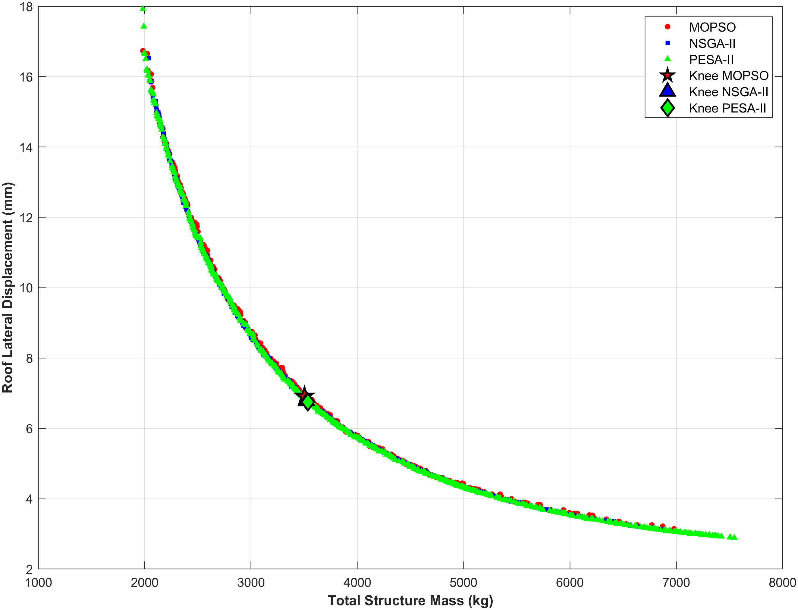

# Multi-objective optimization of I-section steel frames under TCVN 5575:2024: A comparative study of metaheuristic algorithms

**Abstract.** This study addresses the multi-objective design optimization of welded I-section steel frames in stringent compliance with current TCVN 2737:2023 and TCVN 5575:2024 standards. By integrating a custom Finite Element Method (FEM) solver with non-linear penalty function techniques, three metaheuristic algorithms (NSGA-II, PESA-II, MOPSO) are employed to resolve two conflicting design criteria: the minimization of structural steel weight and lateral frame displacement. Analysis of the resulting Pareto fronts demonstrates clear variances in search space exploration capabilities, where "knee-point" identification facilitates the selection of design configurations that are optimal for practical application. Statistical assessment over 30 independent runs per algorithm shows MOPSO converging 2.3–3.7 times faster, while PESA-II attains the best overall Pareto-front quality (highest hypervolume) and the most consistent extreme-stiffness solutions; all three algorithms nonetheless converge to a common knee-point compromise near 3520 kg and 6.8 mm drift, confirming its robustness for practical steel-frame design.

**Keywords:** Multi-objective optimization; steel frames; pareto front; TCVN 5575:2024; metaheuristic; MOPSO; knee-point

## Introduction

Designing steel frames fundamentally requires balancing material economy with lateral stiffness. Because traditional single-objective approaches often yield overly flexible structures, Multi-Objective Optimization (MOO) via metaheuristics is now widely adopted to generate continuous Pareto trade-offs rather than rigid, single-point solutions. In current Vietnamese engineering practice, strict compliance with the newly enacted TCVN 5575:2024 [1] introduces severe non-linear constraints—specifically regarding member slenderness, local plate buckling, and out-of-plane stability. These stringent requirements transform the feasible design space into a highly complex and discontinuous domain. To navigate these practical code boundaries, this research develops an automated computational framework linking an in-house Finite Element Method (FEM) engine with three foundational multi-objective solvers: NSGA-II [3], MOPSO [4], and PESA-II [5]. While newer swarm intelligence variants demonstrate rapid convergence on unconstrained mathematical functions, their actual reliability under heavily codified structural environments demands rigorous verification. Therefore, we deliberately select these three well-documented algorithms to ensure the mathematical accuracy of the derived Pareto fronts. This comparative benchmarking not only identifies the most efficient solver for I-section geometries under the new standard but also establishes a reliable baseline to evaluate future algorithmic advancements in structural optimization [6].

## Framework and Computational Methods

### Mathematical Formulation of the Structural Problem

The bi-objective optimization of frame mass and lateral drift is driven by an eight-dimensional continuous vector defining member cross-sections. To satisfy rigorous strength, global stability, and local buckling constraints mandated by TCVN 5575:2024, a non-linear static penalty function with a large multiplier (R) penalizes constraint violations. An in-house FEM solver evaluates these dynamic responses to guide three established metaheuristics (NSGA-II, MOPSO, PESA-II), each executed over 30 independent trials with a shared population size of 100 individuals (Section 2.2).

$$X={{x}_{1},{x}_{2},{x}_{3},{x}_{4},{x}_{5},{x}_{6},{x}_{7},{x}_{8}{}}^{T}$$  (1)

Where ${x}_{1},{x}_{2},{x}_{3},{x}_{4}$ denote the flange width, web depth, web thickness, and flange thickness of the column cross-section, respectively, while ${x}_{5},{x}_{6},{x}_{7},{x}_{8}$represent the corresponding geometric parameters of the beam section.

Side constraints: 0.20–0.50 m, 0.30–0.80 m, 6–18 mm, 8–22 mm for the column section (x1–x4), and 0.15–0.40 m, 0.25–0.60 m, 5–12 mm, 6–16 mm for the beam section (x5–x8).

$${f}_{1}(x)=ρ\sum_{i=1}^{{N}_{e}} {A}_{i}(x)⋅{L}_{i}$$  (2)

Where $ρ$ denotes the mass density of the steel material; ${A}_{i(x)}$ and ${L}_{i}$ represent the cross-sectional area and length of the i -th element, respectively; and ${N}_{e}$ indicates the total number of elements constituting the frame system.

$${f}_{2}(x)={Δ}_{max}(x)$$  (3)

Where ${Δ}_{max}(x)$defines the maximum lateral displacement value at the top node of the frame, extracted directly from the finite element method (FEM) solver.

$${F}_{k}(x)={f}_{k}(x)+R\sum_{j=1}^{12} {[max((0,{g}_{j}(x)))]}^{2}$$  (4)

Where ${F}_{k}(x)$ and ${f}_{k}(x)$ denote the penalized and original objective functions for the k-th criterion, respectively; R represents the strictly large static penalty parameter; and ${g}_{j}(x)$ signifies the j-th behavioral constraint evaluated within the framework.

In practice, the twelve checks gj(x) (Section 2.1) are reduced to a single worst-case ratio r(x) = maxj gj(x); Eq. (4) is then applied in its equivalent multiplicative form Fk(x) = fk(x)·[1+λ(max(0, r(x)−1))²], λ = 5000.

### Integration and configuration of metaheuristic algorithms

The core of the numerical simulation relies on an in-house Finite Element Method (FEM) code linked with a MATLAB-based TCVN 5575:2024 compliance checking module, built upon the Yarpiz evolutionary-computation templates [7]; design vectors are translated into member forces and displacements, from which the penalty mechanism of Eq. (4) directs the search. Because NSGA-II and PESA-II generate a full offspring population every generation while MOPSO only updates its existing swarm, an equal iteration count does not correspond to an equal computational effort. For a genuinely fair comparison, all three algorithms therefore share the same population size (100 individuals) and are each calibrated, prior to the main runs, to consume an identical budget of 30,000 objective-function evaluations (NFE) — yielding 227, 299 and 300 generations for MOPSO, NSGA-II and PESA-II, respectively (Table 1). Every algorithm is then executed for 30 independent trials under this common budget, ensuring statistically valid Pareto sets and runtimes.

**Table** **1****.** Specific computational variables and initial configurations driving the NSGA-II, MOPSO, and PESA-II routines.

| Item | Algorithm parameters | MOPSO | NSGA-II | PESA-II |
| --- | --- | --- | --- | --- |
| 1 | Population size (Npop​) | 100 | 100 | 100 |
| 2 | Maximum iterations (Itermax​) | 227 | 299 | 300 |
| 3 | Inertia weight (w) | 0.9 | - | - |
| 4 | Acceleration coefficients (c1​,c2​) | 2.0, 2.0 | - | - |
| 5 | Crossover rate (pcross​) | - | 0.7 | 0.5 |
| 6 | Mutation rate (pmut​) | 0.5 | 0.3 | 0.5 |
| 7 | External grid size | 7x7 | - | 7x7 |

## Experimental results and discussion

### Model description and FEM validation

To evaluate the performance of the integrated metaheuristic frameworks, a benchmark two-story, single-span steel plane frame is analyzed under the joint actions of vertical gravity loads and regional equivalent wind pressures. Prior to embedding this structural model into the evolutionary optimization loops, the accuracy of the in-house MATLAB-based Finite Element Method (FEM) code required systematic verification against the industry-standard commercial software SAP2000. The cross-validation process yielded a maximum relative error in nodal displacement of only 0.0445%. This minimal numerical discrepancy confirms that the developed analytical core possesses the necessary precision and reliability for evaluating structural response and objective metrics throughout the iterative optimization process.

**Table 2.** Summary of design variables and input constraints for the numerical frame simulation.

| No. | Model parameters | Symbol | Applied value |
| --- | --- | --- | --- |
| 1 | Main span / Frame spacing | L / B | 10.0 m / 6.0 m |
| 2 | Story 1 height / Story 2 height | H1​ / H2​ | 4.0 m / 4.0 m |
| 3 | Total vertical load (dead + live loads) | qv​ | 10.0 kN/m² |
| 4 | Basic wind pressure [2] | W0​ | 1.55 kN/m² |
| 5 | Yield strength (SS400 steel) | fy​ | 245 MPa |
| 6 | Elastic modulus (SS400 steel) | E | 210000 MPa |

|  |  |
| --- | --- |

**Fig. 1.** Frame configuration and loading diagram [2]

### Pareto front exploration and knee-point identification

The non-dominated solutions obtained by all three algorithms, pooled over 30 independent runs, outline a well-defined convex Pareto front spanning roughly 2.0–7.5 t of mass against 3–18 mm of drift (Fig. 2). Extreme-region behaviour differs only marginally: PESA-II and MOPSO reach statistically indistinguishable minimum masses (best-of-30 1983.2 kg and 1983.7 kg; mean±SD 2074±58 kg and 2108±79 kg), both lighter than NSGA-II (2041 kg best, 2141±70 kg mean). At the stiff extreme, PESA-II is both best (2.89 mm at 7546 kg) and most repeatable (2.99±0.06 mm), against 3.08 mm (NSGA-II) and 3.14 mm (MOPSO) — consistent with its highest average Hypervolume (77.25±0.19 vs. 76.15±0.69 and 74.49±1.27); NSGA-II instead gives the most evenly spaced front (Spacing 0.0068±0.0006). Despite these differences, all three converge to an almost identical knee-point — 3503–3535 kg at 6.75–6.91 mm — indicating that this compromise is essentially algorithm-independent.

**Fig. 2.** Pooled non-dominated solutions (30 runs/algorithm) and consensus knee-points in the mass–drift trade-off space

### Computational Efficiency Benchmarking

Coupling iterative finite element evaluations with metaheuristic loops typically imposes a severe computational burden. Statistical assessments across the same 30 trials (Intel Core i5-1145G7 @ 2.60 GHz, MATLAB R2023b) highlight MOPSO's processing efficiency: an average execution time of 32.95 s is 3.67× faster than the NSGA-II baseline (120.82 s) and 2.29× faster than PESA-II (75.49 s). Even MOPSO's slowest run (49.4 s) beats NSGA-II's fastest (69.2 s), confirming a robust advantage. This speed margin — despite PESA-II's marginally better solution quality (Section 3.2) — makes MOPSO the most practical solver for repeated, code-constrained optimization runs.

**Table** **3****.** Statistical metrics of computational runtimes (in seconds) over 30 independent runs.

| Algorithm | Mean time (tmean​) | Standard deviation (σ) | Fastest run (tmin​) | Slowest run (tmax​) |
| --- | --- | --- | --- | --- |
| MOPSO | 32.95 | 7.84 | 20.44 | 49.39 |
| NSGA-II | 120.82 | 20.92 | 69.23 | 149.21 |
| PESA-II | 75.49 | 16.05 | 39.64 | 92.15 |

## Conclusions

This study develops an automated, FEM-based optimization framework for I-section steel frames under TCVN 5575:2024, yielding the following conclusions:

Solver Performance: MOPSO offers a decisive speed advantage (2.3–3.7× faster, Section 3.3), whereas PESA-II attains the best Pareto-front coverage (highest hypervolume) and the most consistent extreme-stiffness solutions; MOPSO and PESA-II tie on minimum mass (≈1983 kg). No single algorithm dominates every criterion.

Practical Design Application: All three algorithms converge to a common knee-point — 3503–3535 kg at 6.75–6.91 mm lateral drift — a robust, algorithm-independent design compromise.

This baseline methodology is scalable to complex spatial structures; subsequent work will add geometric-stiffness (P–Δ) effects and Reliability-Based Design Optimization (RBDO) for material and load uncertainties.

## References

Ministry of Construction, TCVN 5575:2024: Steel structures - Design standard. Construction Publishing House; 2024.

Ministry of Construction, TCVN 2737:2023: Load and forces - Design standard. Construction Publishing House; 2023.

Deb, K., Pratap, A., Agarwal, S., Meyarivan, T.: A fast and elitist multiobjective genetic algorithm: NSGA-II. IEEE Transactions on Evolutionary Computation 6(2), 182-197 (2002).

Coello Coello, C.A., Pulido, G.T., Lechuga, M.S.: Handling multiple objectives with particle swarm optimization. IEEE Transactions on Evolutionary Computation 8(3), 256-279 (2004).

Corne, D.W., Jerram, N.R., Knowles, J.D., Oates, M.J.: PESA-II: Region-based selection in evolutionary multiobjective optimization. Proceedings of the Genetic and Evolutionary Computation Conference (GECCO-2001), 283-290 (2001).

Kaveh, A.: Advances in Metaheuristic Algorithms for Optimal Design of Structures. Springer Cham; 2021.

Heris, M.K.: Yarpiz Evolutionary Algorithms Toolbox (YPEA). yarpiz.com (2015).
