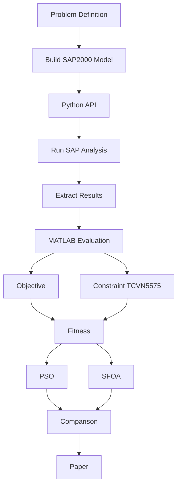

# PSO-SFOA Workflow

```mermaid
flowchart TD

A[Problem Definition]

B[Build SAP2000 Model]

C[Python API]

D[Run SAP Analysis]

E[Extract Results]

F[MATLAB Evaluation]

G[Objective]

H[Constraint TCVN5575]

I[Fitness]

J[PSO]

K[SFOA]

L[Comparison]

M[Paper]

A --> B
B --> C
C --> D
D --> E
E --> F
F --> G
F --> H
G --> I
H --> I
I --> J
I --> K
J --> L
K --> L
L --> M

```